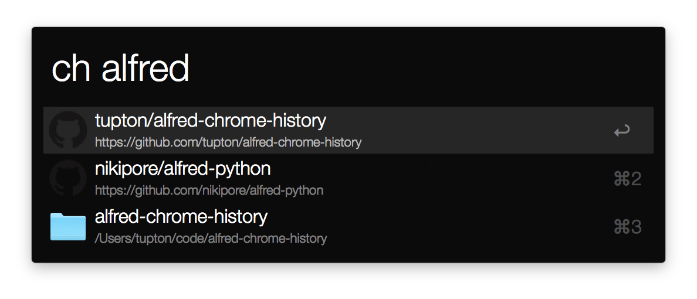

# Alfred Chrome History Workflow

Access your Google Chrome history from Alfred with `ch {query}`.



## How to install

[Download the workflow from the releases page][releases] and install by double-clicking it.

  [releases]: https://github.com/tupton/alfred-chrome-history/releases

### From source

Clone this repo and symlink it to `<sync directory>/Alfred.alfredpreferences/workflows/alfred-chrome-history`. Your Alfred sync directory can be found going to Preferences → Advanced → Syncing.

Then run `make dev` to install requirements and set the repository up to be used as a workflow.

## Configuration

The workflow should work out of the box with the `ch` prefix. If you'd like to change this, update the keyword in the Alfred workflow's script filter.

### Choosing the correct Google Chrome profile directory

The Alfred script filter is set up to use the default Chrome profile located in `~/Library/Application Support/Google/Chrome/Default`. If you need to use a different profile, update the `PROFILE` environment variable in the Alfred workflow's script filter. This could be the necessary if you have signed in to Chrome with different or multiple accounts, and usually the profile directory is located in something like `Profile 1`. If that is the case, the entire Script contents in the workflow's script filter would be:

```sh
PROFILE="~/Library/Application Support/Google/Chrome/Profile 1"
PATH="env/bin:$PATH"
python3 chrome.py "${PROFILE}" "{query}"
```

In a terminal, the following command can help you find the exact location of the profile directory that the workflow needs:

```sh
ls ~/Library/Application\ Support/Google/Chrome/ | grep Profile
```

### Disabling favicon support

By default, the script tries to grab favicons from a separate database. This can sometimes slow down the results, which is not desirable. To turn off favicon support, pass `--no-favicons` in the Alfred workflow's script filter. The last line of the script should look like the following:

```sh
python3 chrome.py "${PROFILE}" "{query}" --no-favicons
```

## How to build

`make workflow` will put any dependencies in place and build `alfred-chrome-history.alfredworkflow` in the current directory.

Note that `sitepackages.py` attempts to find `alfred.py` and copy it into the workflow archive. Please let me know if this script fails to find `alfred.py`. It attempts to find it in both global installations and within a virtualenv, but I have only tested this on my local machine.

`make dev` also puts dependencies in place so that the workflow can work when symlinked to the correct workflows directory as mentioned above.

## Thanks

This workflow uses the wonderful [alfred-python][ap] library. It is provided in the generated workflow and does not need to be installed globally or otherwise before using this workflow.

  [ap]: https://github.com/nikipore/alfred-python
